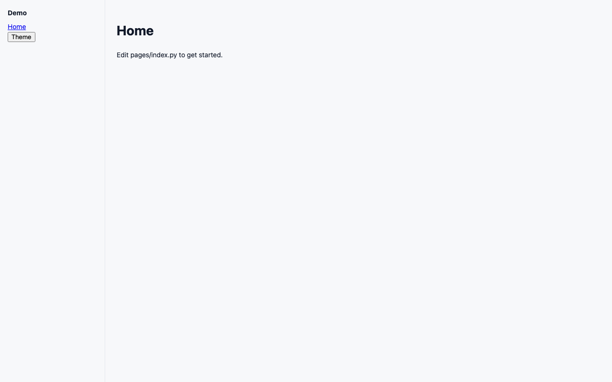

# SnackApp

A Python application framework with SnackBase embedded. One install, one command, a working multi-user app.

```bash
python -m pip install --only-binary=:all: \
  --extra-index-url https://test.pypi.org/simple/ \
  snackapp==0.1.1 snackbase==0.12.1
snackapp init demo
cd demo
snackapp run
```

`--only-binary=:all:` keeps pip from building TestPyPI source distributions (TestPyPI hosts a broken FastAPI sdist). Dependencies that are not on TestPyPI still resolve from PyPI.

When `snackapp` is on [pypi.org](https://pypi.org/project/snackapp/), `pip install snackapp` is enough.

Open http://localhost:8000 and log in with the credentials printed on first boot.



See `examples/crm` for a Twenty-inspired CRM built only on the public API.

## Versioning

SnackApp is `0.1.1`. Before `1.0`, breaking changes may appear in minor releases. Pin `snackapp~=0.1` if you need a freeze.

## Publishing

`snackbase 0.12.1` and `snackapp 0.1.1` are on [TestPyPI](https://test.pypi.org/project/snackapp/). CI publishes to PyPI from a `v*` tag using [trusted publishing](https://docs.pypi.org/trusted-publishers/) (`id-token: write`, no API token in the repo). Publish `snackbase` first, then `snackapp`.

PyPI trusted publisher settings (once the production PyPI projects exist):

| Field | snackbase | snackapp |
| --- | --- | --- |
| Owner | `lalitgehani` | `lalitgehani` |
| Repository | `SnackBase` | `snackapp` |
| Workflow | `publish.yml` | `publish.yml` |
| Environment | `pypi` | `pypi` |

Do not push a `v*` tag until those publishers are saved on pypi.org.

## Docs

- Install, tutorial, `ui.*`, field types: `docs/` in this repo and [SnackApp in the SnackBase docs](https://docs.snackbase.dev/guides/snackapp)
- Deployment: [`docs/DEPLOY.md`](docs/DEPLOY.md)
